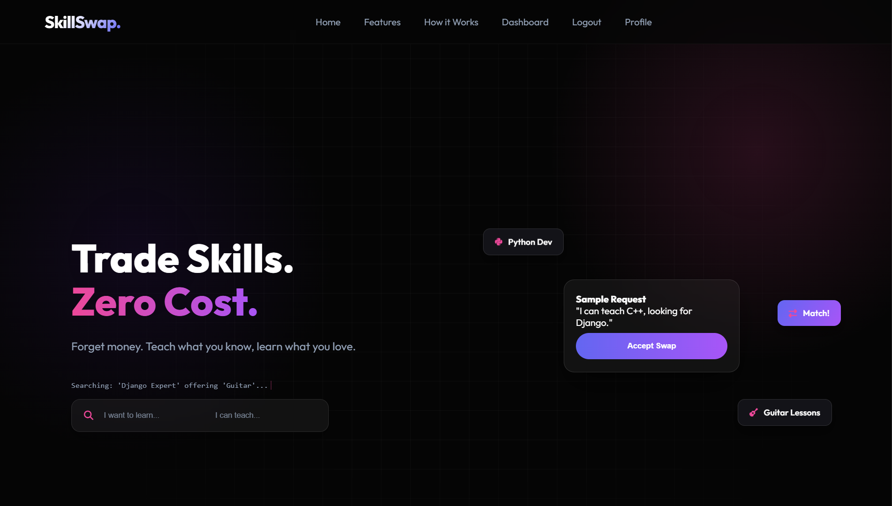
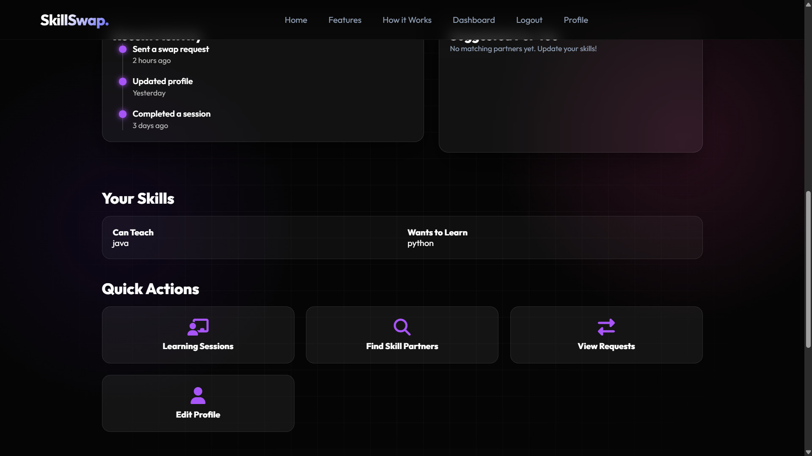
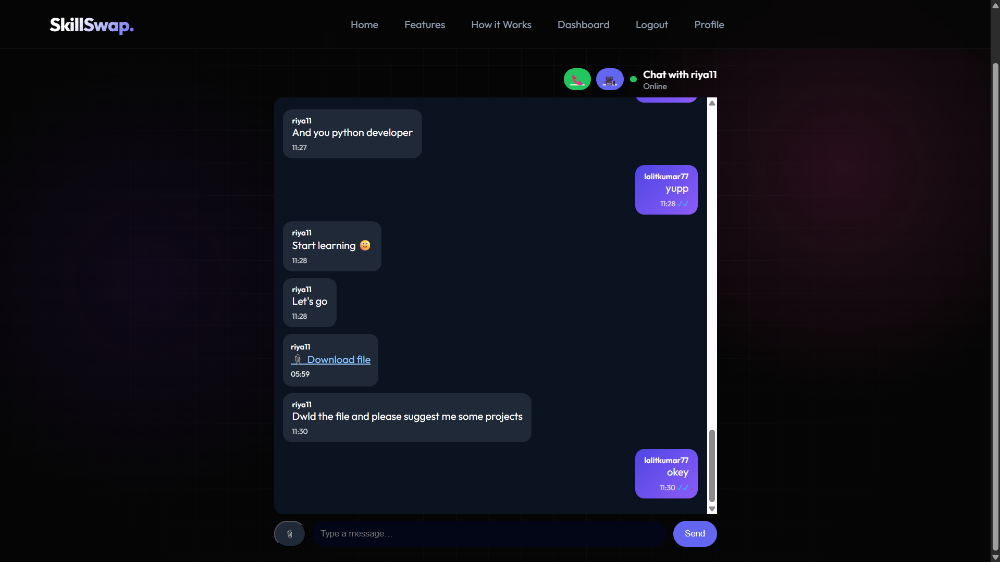
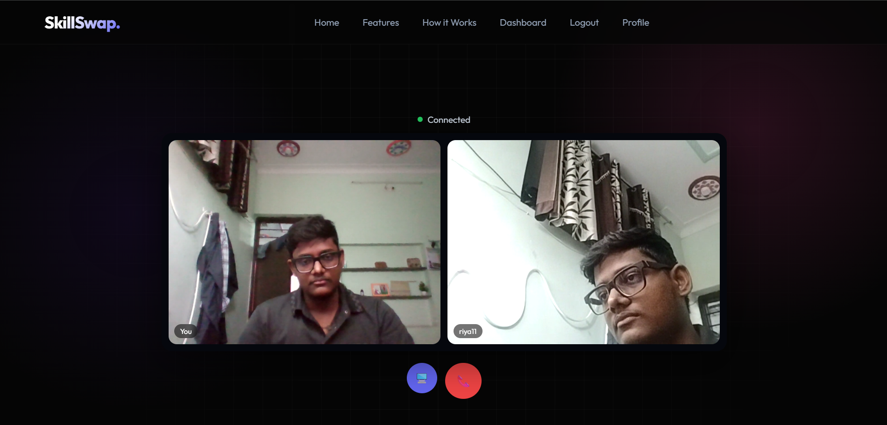
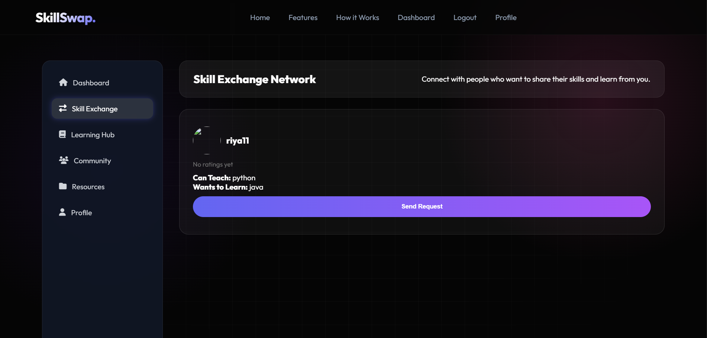

# SkillSwap 🔄

**Trade Skills. Zero Cost.**

SkillSwap is a peer-to-peer skill exchange platform where users teach what they know and learn what they love — no money involved. Built with Django, Django Channels, and WebRTC, it supports real-time chat, live video/voice calling, smart skill matching, and a shared resource library.

🔗 **Live Demo:** [www.skillswap.store](https://www.skillswap.store)

---

## ✨ Features

- **User Profiles** — Showcase skills you can teach, skills you want to learn, availability, and skill level
- **Smart Matching Engine** — Find complementary matches based on mutual teach/learn interests, with a compatibility score
- **Swap Requests** — Send, accept, or reject skill exchange requests with clear status tracking
- **Learning Sessions** — Auto-created once a swap is accepted, with post-session reviews and ratings
- **Real-Time Chat** — WebSocket-powered messaging with:
  - Live delivery (no refresh needed)
  - Online/offline presence per conversation
  - WhatsApp-style delivery & read receipts (✔ / ✔✔)
  - File and image sharing
- **Live Video & Voice Calling** — WebRTC-based 1-on-1 calls with:
  - Site-wide incoming call notifications (works even if you're not on the chat page)
  - Automatic caller/callee role assignment
  - Clean call-ended handling with names and auto-redirect
- **Trust Score & Badges** — Reputation system based on session reviews (New Learner → Expert Mentor)
- **Resource Library** — Share notes, files, and links tagged by skill, searchable by the community
- **Dashboard** — Central hub for matches, ongoing sessions, and profile stats

---

## 🛠️ Tech Stack

| Layer | Technology |
|---|---|
| Backend | Django 6.0, Django Channels (ASGI) |
| Real-time | WebSockets via Daphne, Redis channel layer |
| Video/Voice | WebRTC (peer-to-peer, STUN-based signaling) |
| Database | PostgreSQL (production), SQLite (local dev) |
| Static/Media | WhiteNoise |
| Frontend | HTML, CSS, vanilla JavaScript |
| Deployment | Railway |

---

## 📂 Project Structure

```
SkillSwap/
├── users/          # Registration, login, authentication
├── profiles/       # User profiles, badges, trust score
├── matching/        # Skill matching engine & search
├── swap/            # Swap requests, learning sessions, reviews
├── chat/            # Real-time chat (WebSocket consumer + models)
├── calls/           # Video/voice calling (WebRTC signaling)
├── resources/       # Community resource sharing library
├── templates/        # HTML templates
├── static/           # CSS, JS, sounds, images
└── SkillSwap/         # Project settings, URLs, ASGI config
```

---

## 🚀 Getting Started (Local Setup)

### Prerequisites
- Python 3.11+
- pip

### Installation

```bash
git clone https://github.com/Lalitprajapat47/skillswap.git
cd skillswap

python -m venv venv
venv\Scripts\activate        # Windows
# source venv/bin/activate   # macOS/Linux

pip install -r requirements.txt
```

### Environment Variables

Create a `.env` file in the project root:

```
SECRET_KEY=your-secret-key-here
DEBUG=True
ALLOWED_HOSTS=127.0.0.1,localhost
CSRF_TRUSTED_ORIGINS=
REDIS_URL=
```

### Run migrations & start the server

```bash
python manage.py migrate
python manage.py createsuperuser
python manage.py runserver
```

Visit `http://127.0.0.1:8000` in your browser.

> **Note:** For local development, `channels` falls back to an in-memory layer automatically if `REDIS_URL` is not set — no Redis installation required to get started.

---

## 🌐 Deployment

SkillSwap is deployed on [Railway](https://railway.app) with:
- PostgreSQL for the database
- Redis for the Channels layer (required for WebSocket chat/calls to work reliably in production)
- Daphne as the ASGI server

Start command used in production:
```
python manage.py migrate && python manage.py collectstatic --noinput && daphne -b 0.0.0.0 -p $PORT SkillSwap.asgi:application
```

---

## 📸 Screenshots

### Home Page


### Dashboard


### Real-Time Chat


### Video Calling


### Skill Search & Matching


---

## 🧑‍💻 Author

Built by **Lalit Prajapat** as a minor project (5th Semester).

---

## 📄 License

This project is open source and available for educational use.
